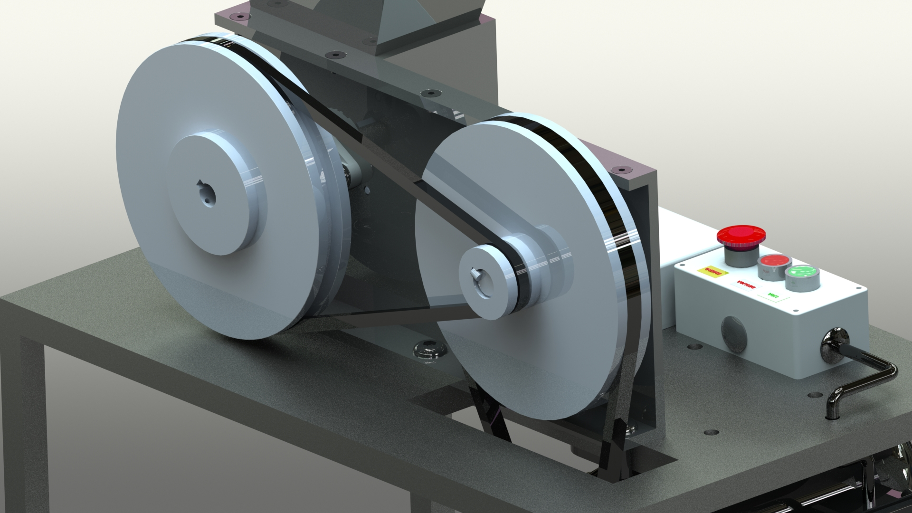

# **Triturador**

Projeto de conclusão de curso do técnico em eletromecânica do SENAI Londrina 2017

### Integrantes da equipe

 - Álvaro Neto
 - Gabriel Marques
 - Lucas Lima
 - Henrique Battu
 - Nicolas Borini
 - Wellington Borges

### Sobre o Projeto

O projeto consistia de projetar, levantando material técnico, desenhar e implementar um triturador de plástico automatizado, levando em conta o baixo custo.

Este projeto seria o ínicio de uma série de máquinas que resultaria em uma produção de filamento para impressora 3D de baixo custo, utilizando matéria-prima reciclada

### Softwares utilizados

Para visualizar o projeto completamente é necessário um conjunto de softwares. São eles:

 - SolidWorks 2015 ou mais recente;
 - Proteus;
 - Astah;
 - Dia;
 - Fritzing;
 - Microsoft Word e PowerPoint;
 - Editor de texto;

#### Máquina
 - [x] Modelagem SolidWorks 2015
 - [x] Lista de materiais
 - [x] Cronograma de atividades
 - [x] Referências
 - [x] Trabalho escrito
 - [ ] Cosntrução da máquina

#### Código
- [x] Digramas de casos de uso
- [x] Diagrama de máquina de estados
- [x] Projeto ISIS Proteus
- [x] Projeto Fritzing
- [x] Detecção de objetos
- [x] Acionamento do motor
- [ ] Auto-reverse do motor

### Imagens renderizadas do projeto

## TODO terminar de colocar os arquivos no repositório

 - [ ] Documentos parte eletrônica
 - [ ] Arquivos SolidWorks
